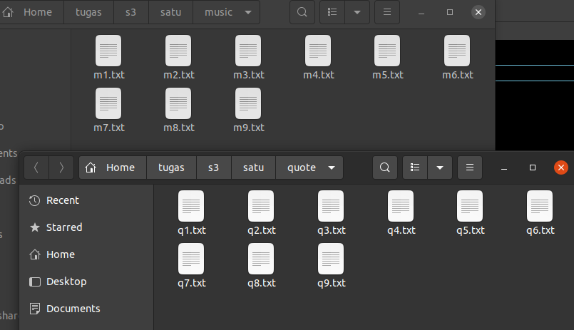
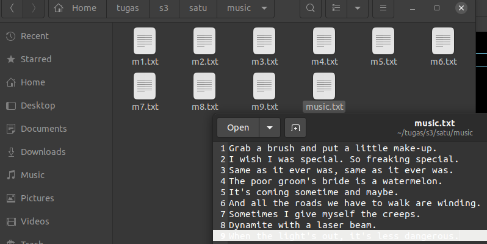
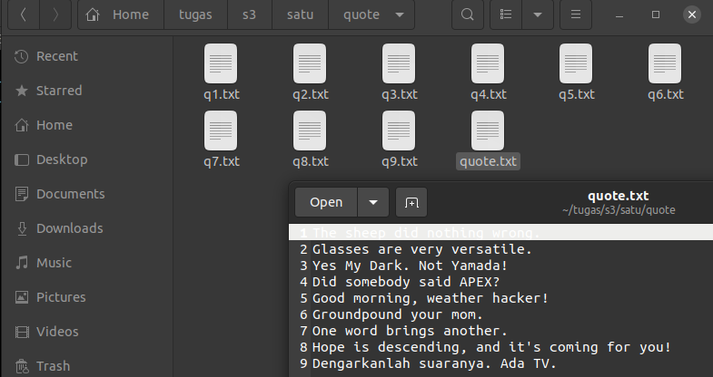
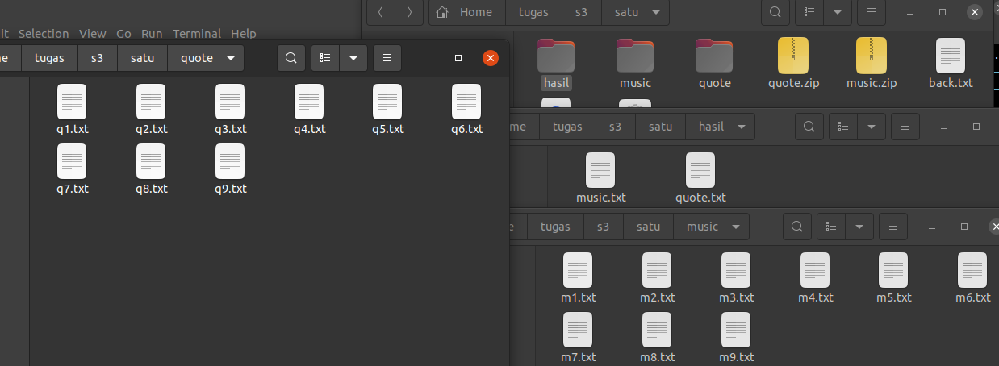
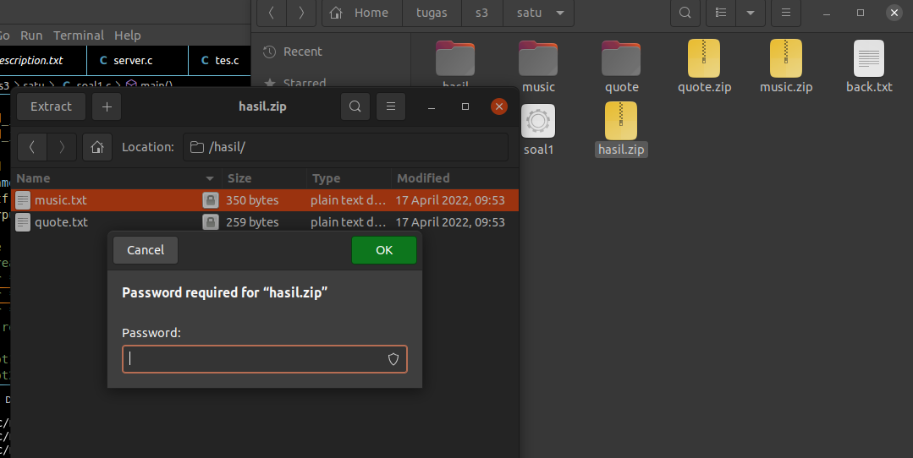
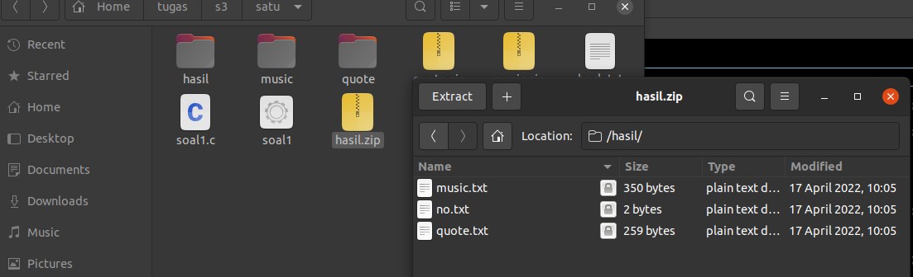
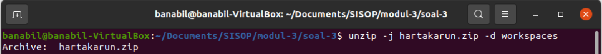
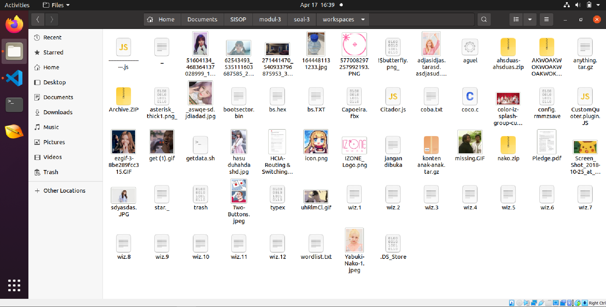
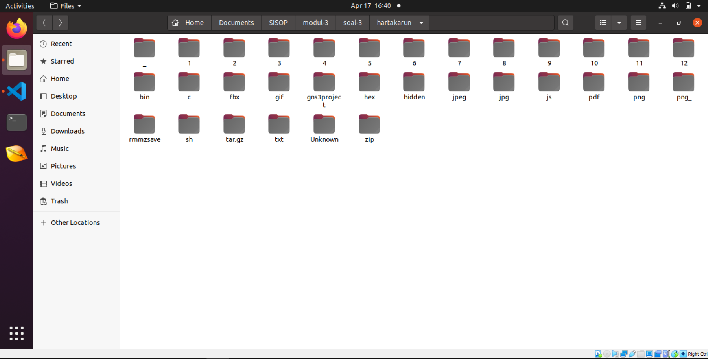

# soal-shift-sisop-modul-3-ITA13-2022

## preliminary
Library yang digunakan:
```C
#include<stdio.h>
#include<string.h>
#include<pthread.h>
#include<stdlib.h>
#include<unistd.h>
#include<sys/types.h>
#include<sys/wait.h>
#include <dirent.h>
#include <stdint.h>
```

Fungsi yang digunakan:

1. Base64 ke string
```C
/* ---- Base64 Encoding/Decoding Table --- */
char b64[] = "ABCDEFGHIJKLMNOPQRSTUVWXYZabcdefghijklmnopqrstuvwxyz0123456789+/";

void decodeblock(unsigned char in[], char *clrstr) {
  unsigned char out[4];
  out[0] = in[0] << 2 | in[1] >> 4;
  out[1] = in[1] << 4 | in[2] >> 2;
  out[2] = in[2] << 6 | in[3] >> 0;
  out[3] = '\0';
  strncat(clrstr, out, sizeof(out));
}

void b64_decode(char *b64src, char *clrdst) {
  int c, phase, i;
  unsigned char in[4];
  char *p;

  clrdst[0] = '\0';
  phase = 0; i=0;
  while(b64src[i]) {
    c = (int) b64src[i];
    if(c == '=') {
      decodeblock(in, clrdst); 
      break;
    }
    p = strchr(b64, c);
    if(p) {
      in[phase] = p - b64;
      phase = (phase + 1) % 4;
      if(phase == 0) {
        decodeblock(in, clrdst);
        in[0]=in[1]=in[2]=in[3]=0;
      }
    }
    i++;
  }
}

/* encodeblock - encode 3 8-bit binary bytes as 4 '6-bit' characters */
void encodeblock( unsigned char in[], char b64str[], int len ) {
    unsigned char out[5];
    out[0] = b64[ in[0] >> 2 ];
    out[1] = b64[ ((in[0] & 0x03) << 4) | ((in[1] & 0xf0) >> 4) ];
    out[2] = (unsigned char) (len > 1 ? b64[ ((in[1] & 0x0f) << 2) |
             ((in[2] & 0xc0) >> 6) ] : '=');
    out[3] = (unsigned char) (len > 2 ? b64[ in[2] & 0x3f ] : '=');
    out[4] = '\0';
    strncat(b64str, out, sizeof(out));
}

/* encode - base64 encode a stream, adding padding if needed */
void b64_encode(char *clrstr, char *b64dst) {
  unsigned char in[3];
  int i, len = 0;
  int j = 0;

  b64dst[0] = '\0';
  while(clrstr[j]) {
    len = 0;
    for(i=0; i<3; i++) {
     in[i] = (unsigned char) clrstr[j];
     if(clrstr[j]) {
        len++; j++;
      }
      else in[i] = 0;
    }
    if( len ) {
      encodeblock( in, b64dst, len );
    }
  }
}
```

2. exec dengan eksekusi tertentu
```C
void *garputunggu_unzip( void *ptr )
{
    char *message;
    message = (char *) ptr;
    int status;
    pid_t child;
    if(strcmp(message, "quote.zip") == 0) {
        while(statusA != 1){}
        child = fork();
        if(child == 0){
            execlp("unzip", "unzip", message, "-d", "quote", NULL);
        }
        else{
            ((wait(&status))>0);
        }
        statusA = 2;
    } else if (strcmp(message, "music.zip") == 0){
        while(statusA != 2) {}
        child = fork();
        if(child == 0){
            execlp("unzip", "unzip", message, "-d", "music", NULL);
        }
        else{
            ((wait(&status))>0);
        }
    } else {
        while(statusR != 1){};
        char passw[100];
        char *nama_user;
        nama_user=(char *)malloc(10*sizeof(char));
        nama_user=getlogin();
        snprintf(passw, sizeof(passw), "mihinomenest%s", nama_user);
        child = fork();
        if(child == 0){
            execlp("unzip", "unzip", "-P", passw, message, NULL);
        }
        else{
            ((wait(&status))>0);
        }
        statusR = 2;
    }
}


void *garputunggu_mkdir( void *ptr )
{
    char *message;
    message = (char *) ptr;
    int status;
    pid_t child;
    child = fork();
    if(child == 0){
        execlp("mkdir", "mkdir", message, NULL);
    }
    else{
        ((wait(&status))>0);
    }
    statusA = 1;
}


void *garputunggu_hapus_dir( void *ptr )
{
    char *message;
    message = (char *) ptr;
    int status;
    pid_t child;
    child = fork();
    if(child == 0){
        execlp("rm", "rm", "-r", message, NULL);
    }
    else{
        ((wait(&status))>0);
    }
    statusR = 1;
}


void *garputunggu_hapus_file( void *ptr )
{
    while(statusR != 3) {}
    char *message;
    message = (char *) ptr;
    int status;
    pid_t child;
    child = fork();
    if(child == 0){
        execlp("rm", "rm", message, NULL);
    }
    else{
        ((wait(&status))>0);
    }
}


void *garputunggu_file( void *ptr )
{
    char *message;
    message = (char *) ptr;

    if(strcmp(message, "hasil") == 0) {
        while(statusR != 2) {}
        char nulis[100];
        snprintf(nulis, sizeof(nulis), "./%s/no.txt", message);
        FILE *tambahan = fopen(nulis, "w");
        fprintf(tambahan, "No");
        fclose(tambahan);
        statusR = 3;
    } else {
        DIR *filebuka;
        struct dirent *ep;

        char nulis[100];
        snprintf(nulis, sizeof(nulis), "./%s/%s.txt", message, message);

        FILE *translate = fopen(nulis, "w");

        filebuka = opendir(message);
        if(filebuka != NULL) {
            while(ep = readdir(filebuka)) {
                if(strcmp(ep->d_name, ".") != 0 && strcmp(ep->d_name, "..") != 0) {
                    char line[200];
                    char awal[300];
                    snprintf(awal, sizeof(awal), "./%s/%s", message, ep->d_name);
                    FILE *terbuka = fopen(awal, "r");
                    while(fgets(line, sizeof(line), terbuka)) {
                        // long panjang_line = strlen(line);
                        // char * Ltrans = base64_decode(line, panjang_line, &panjang_line);
                        char hasilT[100];
                        b64_decode(line, hasilT);
                        fprintf(translate, "%s\n", hasilT);
                    }
                    fclose(terbuka);
                }
            }
            (void) closedir (filebuka);
        } else  perror ("Couldn't open the directory");

        fclose(translate);
    }

}


void *garputunggu_move( void *ptr )
{
    char *message;
    message = (char *) ptr;
    int status;
    pid_t child;
    if(strcmp(message, "quote") == 0) {
        child = fork();
        if(child == 0){
            char awal[100];
            snprintf(awal, sizeof(awal), "./%s/quote.txt", message);
            execlp("mv", "mv", awal, "./hasil", NULL);
        }
        else{
            ((wait(&status))>0);
        }
    } else {
        child = fork();
        if(child == 0){
            char awal[100];
            snprintf(awal, sizeof(awal), "./%s/music.txt", message);
            execlp("mv", "mv", awal, "./hasil", NULL);
        }
        else{
            ((wait(&status))>0);
        }
    }
}


void zip_garputunggu(char passw[], char namaz[], char namaf[]) {
    int status;
    pid_t child;
    child = fork();
    if(child == 0){
        execlp("zip", "zip", "-P", passw, "-r", namaz, namaf, NULL);
    }
    else{
        ((wait(&status))>0);
    }
}


void garputunggu(char bash[], char *arg[]){
    int status;
    pid_t child;
    child = fork();
    if(child == 0){
        execv(bash, arg);
    }
    else{
        ((wait(&status))>0);
    }
}
```

3. Variable diluar main untuk fungsi:
```C
int statusR = 0;
int statusA = 0;
```

# soal 1 
## a
### Summary
Melakukan unzip dari file music.zip dan quote.zip secara bersamaan dan memasukkan ke dalam folder secara bersamaan(?).

## Source Code
```C
pthread_t threadawal[4];
char *mkdirQ = "quote";
char *mkdirM = "music";
char *unzipQ = "quote.zip";
char *unzipM = "music.zip";
int  mkdir1, mkdir2, unzip1, unzip2;;

// a
mkdir1 = pthread_create( &threadawal[1], NULL, garputunggu_mkdir, (void*) mkdirQ); //membuat thread pertama
mkdir2 = pthread_create( &threadawal[2], NULL, garputunggu_mkdir, (void*) mkdirM);//membuat thread kedua
unzip1 = pthread_create( &threadawal[3], NULL, garputunggu_unzip, (void*) unzipQ); //membuat thread pertama
unzip2 = pthread_create( &threadawal[4], NULL, garputunggu_unzip, (void*) unzipM);//membuat thread kedua

pthread_join( threadawal[1], NULL);
pthread_join( threadawal[2], NULL); 
pthread_join( threadawal[3], NULL);
pthread_join( threadawal[4], NULL); 
```

### Penjelasan
1. Deklarasikan thread yang akan digunakan dengan `pthread_t`, yakni sebanyak 4.
2. Deklarasi nilai int agar nilai berhasil atau tidaknya ke dalam int tersebut.
3. Masing-masing int yangtelah dideklarasi, panggil fungsi thread dengan `pthread_create` dengan parameter: (alamat array dari thread, `NULL`, nama fungsi yang akan digunakan, parameter yang akan digunakan oleh fungsi).
4. Setelah dilakukan, tidak lupa untuk melakukan join dengan menggunakan `pthread_join` dengan parameter (array hasil create, `NULL`).

### Hasil




### Kendala
NULL

## b

### Summary 
Tiap folder yang di unzip sebelumnya berisi file dengan isi string yang diencode ke Base64. Decode string tersebut ke plaintext dengan hasilnya dimasukkan ke dalam file baru bernama `quote.txt` atau `music.txt` sesuai nama folder di masing-masing folder, sehingga terdapt dua file.txt berbeda di dua folder yang berbeda pula.

### Source code
```C
pthread_t threadFile[2];//inisialisasi awal
char *fileQ = "quote";
char *fileM = "music";
int  file1, file2;

file1 = pthread_create( &threadFile[1], NULL, garputunggu_file, (void*) fileQ); //membuat thread pertama
file2 = pthread_create( &threadFile[2], NULL, garputunggu_file, (void*) fileM);//membuat thread kedua

pthread_join( threadFile[1], NULL);
pthread_join( threadFile[2], NULL); 
```

### Penjelasan
Sama seperti langkah point a sebelumnya, hanya saja mengubah banyak thread yang digunakan (2), dan parameter fungsi di dalam fungsi `pthread_create`, kemudian di join dengan `pthread_join`.

Langkah decode Base64:
1. Membuka folder yang dipilih.
2. Baca tiap file di dalam folder tersebut dengan membua satu-satu file.txt tersebut.
3. File.txt yang dibuka, baca line pertama, lalu gunakan fungsi `base54_encode`.
4. Lalu masukkan hasilnya ke dalam `hasil.txt`
4. Repat untuk file.txt lainnya dengan cara yang sama di folder satu lagi.

### Hasil





### Kendala
NULL

## c
### Summary
Pindah kedua file `hasil.txt` dari kedua folder ke folder baru bernama 'hasil'.

### Source Code
```C
char *buathasil[] = {"mkdir", "hasil", NULL};
garputunggu("/bin/mkdir", buathasil);

pthread_t threadMove[2];//inisialisasi awal
char *moveQ = "quote";
char *moveM = "music";
int  move1, move2;

move1 = pthread_create( &threadMove[1], NULL, garputunggu_move, (void*) moveQ); //membuat thread pertama
move2 = pthread_create( &threadMove[2], NULL, garputunggu_move, (void*) moveM);//membuat thread kedua

pthread_join( threadMove[1], NULL);
pthread_join( threadMove[2], NULL); 
```

### Penjelasan
Cara yang sama seperti point-ponts sebelumnya.

Langkah memindahkan file:
1. Panggil fungsi `garputunggu` untu membuat folder baru bernama 'hasil'
2. Buka folder music/quote.
3. Mencari file dengan nama `nama_folder + .txt`.
4. Pindahkan ke folder hasil.

### Hasil



### Kendala
Awalnya bingung apakah membuat folder secara bersamaan atau tidak, tetapi asisten tidak mempertanyakan hal tersebut.

## d

### Summary
Folder 'hasil' akan di-zip dengan password 'mihinomenest' + nama_user.

## Source Code
```C
char name[100];
snprintf(name, sizeof(name), "mihinomenest%s", nama_user);
zip_garputunggu(name, "hasil.zip", "hasil");
```

### Penjelasan
Program hanya memanggil fungsi membuat folder dengan parameter (password, nama_zip_output, nama_folder_dizip).
Cara mendapatkan nama user:
```C
char *nama_user;
nama_user=(char *)malloc(10*sizeof(char));
nama_user=getlogin();
```

### Hasil



### Kendala
Tidak ada penjelasan apakah menggunakan thread atau tidak. Namun asisten tidak mempertanyakan.

## e

### Summary
Karena pengen ngerepotin praktikan, unzip 'hasil.zip' lalu buat file bernama no.txt dengan isinya string 'No' ke dalam folder hasil, lalu zip kembali folder hasil seperti point d.

## Source Code
```C
pthread_t ngulang[10];
char * repothapus = "hasil";
char * repotzip = "hasil.zip";
char * repotfile = "hasil";
int repot1, repot2, repot3, repot4;

repot1 = pthread_create( &ngulang[1], NULL, garputunggu_hapus_dir, (void*) repothapus); //membuat thread pertama
repot2 = pthread_create( &ngulang[2], NULL, garputunggu_unzip, (void*) repotzip);//membuat thread kedua
repot3 = pthread_create( &ngulang[3], NULL, garputunggu_file, (void*) repotfile);
repot4 = pthread_create( &ngulang[4], NULL, garputunggu_hapus_file, (void*) repotzip);

pthread_join( ngulang[1], NULL);
pthread_join( ngulang[2], NULL); 
pthread_join( ngulang[3], NULL); 
pthread_join( ngulang[4], NULL); 

char name2[100];
snprintf(name2, sizeof(name2), "mihinomenest%s", nama_user);
zip_garputunggu(name2, "hasil.zip", "hasil");
```
### Penjelasan
Thread dilakukan cara yang sama dengan point-point sebelumnya dengan urutan:
1. Hapus Folder hasil di luat hasil.zip.
2. Unzip File.
3. Buat no.txt di dalam folder hasil.
4. Tulis string 'No' di dalam no.txt.
5. Unzip folder hasil dengan password ketentuan sebelumnya.

### Hasil



### Kendala
NULL


# soal 2

## Preliminary
- Library yang digunakan
```C
#include <stdio.h>
#include <sys/socket.h>
#include <stdlib.h>
#include <netinet/in.h>
#include <sys/types.h>
#include <sys/stat.h>
#include <string.h>
#include <unistd.h>
#include <stdbool.h>
```


- Konfigurasi client
```C
#define PORT 8080
int main(int argc, char const *argv[]) {
    struct sockaddr_in address;
    int sock = 0, valread;
    struct sockaddr_in serv_addr;
    // char *hello = "Hello from client";
    char buffer[1024] = {0};
    if ((sock = socket(AF_INET, SOCK_STREAM, 0)) < 0) {
        printf("\n Socket creation error \n");
        return -1;
    }
  
    memset(&serv_addr, '0', sizeof(serv_addr));
  
    serv_addr.sin_family = AF_INET;
    serv_addr.sin_port = htons(PORT);
      
    if(inet_pton(AF_INET, "127.0.0.1", &serv_addr.sin_addr)<=0) {
        printf("\nInvalid address/ Address not supported \n");
        return -1;
    }
  
    if (connect(sock, (struct sockaddr *)&serv_addr, sizeof(serv_addr)) < 0) {
        printf("\nConnection Failed \n");
        return -1;
    }

    // a
    while(1) {
    // Koding dimulai disini
    }
   
    return 0;
}
```

- Konfigursi server
```C
bool is_mixed(char* str) {

    int   i;
    bool  found_lower = false, found_upper = false;

    for (int i = 0; str[i] != '\0'; i++) {
        found_lower = found_lower || (str[i] >= 'a' && str[i] <= 'z');
        found_upper = found_upper || (str[i] >= 'A' && str[i] <= 'Z');

        if (found_lower && found_upper) break;
    }

    return (found_lower && found_upper);

}


#define PORT 8080
int main(int argc, char const *argv[]) {
    int server_fd, new_socket, valread;
    struct sockaddr_in address;
    int opt = 1;
    int addrlen = sizeof(address);
    char buffer[1024] = {0};
    char *hello = "Hello from server";
      
    if ((server_fd = socket(AF_INET, SOCK_STREAM, 0)) == 0) {
        perror("socket failed");
        exit(EXIT_FAILURE);
    }
      
    if (setsockopt(server_fd, SOL_SOCKET, SO_REUSEADDR | SO_REUSEPORT, &opt, sizeof(opt))) {
        perror("setsockopt");
        exit(EXIT_FAILURE);
    }

    address.sin_family = AF_INET;
    address.sin_addr.s_addr = INADDR_ANY;
    address.sin_port = htons( PORT );
      
    if (bind(server_fd, (struct sockaddr *)&address, sizeof(address))<0) {
        perror("bind failed");
        exit(EXIT_FAILURE);
    }

    if (listen(server_fd, 3) < 0) {
        perror("listen");
        exit(EXIT_FAILURE);
    }

    if ((new_socket = accept(server_fd, (struct sockaddr *)&address, (socklen_t*)&addrlen))<0) {
        perror("accept");
        exit(EXIT_FAILURE);
    }


    printf("Connected to port %d\n", PORT);

    if(access( "problem.tsv", F_OK ) != 0) {
        FILE *tsv = fopen("problem.tsv", "a+");
        fprintf(tsv, "Judul\tAuthor\n");
        fclose(tsv);
    }
    
    while(1) {
    // Koding mulai di sini
    }
    
    return 0;
}
```
## a

### Summary
Membuat sistem server-client login dan register. Tiap user baru yang masuk, akan dimasukkan ke dalam file 'user.txt' pada folder client denga format `username:password`.
Ketentuan register:
1. Username unik.
2. Pssword harus alphanumeric, terdapat upper dan lower case dan panjangnya harus lebih dari 6 karakter.
Saat logn, sever mengecek username dan password yang dimasukkan ke dalam client.

### Source Code
- Client
```C
char awal1[100] = {0};
char username[100];
char password[100];
printf("Masuk or Daftar?!\n");
printf("1. Masuk\n2. Daftar\n>>> ");
scanf("%s", awal1);
send(sock , awal1 , 100, 0 );

printf("Loading.....\n");
read( sock , buffer, 1024);
if(strcmp(buffer, "M") == 0) {
    printf("Hello\n");
    printf("Username: ");
    scanf("%s", username);
    send(sock , username , 100, 0 );

    printf("Password: ");
    scanf("%s", password);
    send(sock , password , 100, 0 );

    read( sock , buffer, 1024);
    if(strcmp(buffer, "success") == 0) {
        // Do something kalau berhasil masuk
    } else {
        printf("Sorry, wrong username/password\n");
    }
} else if(strcmp(buffer, "D") == 0) {
    printf("Username: ");
    scanf("%s", username);
    send(sock , username , 100, 0 );

    printf("Password: ");
    scanf("%s", password);
    send(sock , password , 100, 0 );
    
    read(sock, buffer, 1024);
    if(strcmp(buffer, "allow") == 0) {
        printf("Selamat datang!\n\n");
    } else if(strcmp(buffer, "denied_exist") == 0){
        printf("Gagal daftar: Sudah ada pengguna dengan username itu.\n\n");
    } else {
        printf("Gagal daftar: Password harus lebih dari 6 karakter dan Alphanumeric Upper/lower\n\n");
    }
}
```

- Server
```C
char username[1024] = {0};
char password[1024] = {0};
char terdaftar[3000];


read( new_socket , buffer, 1024);
if(strcmp(buffer, "Masuk") == 0) {
    printf("Proses Masuk dijalankan\n");
    send(new_socket , "M" , 100 , 0 );

    read( new_socket , username, 1024);
    // printf("Username: %s", username);
    
    read( new_socket , password, 1024);
    // printf("Password: %s", password);
    
    FILE *file_terdaftar = fopen("akun.txt", "r");
    char line[200];
    while(fgets(line, sizeof(line), file_terdaftar)) {
        char *pisah = strtok(line, ":");
        printf("%s\n", line);
        if(strcmp(pisah, username) == 0) {
            pisah = strtok(NULL, ":");
            printf("%s\n", pisah);
            pisah[strcspn(pisah, "\n")] = 0;
            if(strcmp(pisah, password) == 0) {
                send(new_socket , "success" , 100 , 0 );
                break;
            } else  {
                send(new_socket , "error" , 100 , 0 );
                break;
            }
        } 
        }
    
    fclose(file_terdaftar);
    

} else if(strcmp(buffer, "Daftar") == 0) {
    printf("Proses Daftar dijalankan\n");
    send(new_socket , "D" , 100 , 0 );

    read( new_socket , username, 1024);
    // printf("Username: %s", username);
    
    read( new_socket , password, 1024);
    // printf("Password: %s", password);

    FILE *file_terdaftar = fopen("akun.txt", "a+");
    char line[200];
    int check = 0;
    while(fgets(line, sizeof(line), file_terdaftar)) {
        // char terpilih[1000];
        char *pisah = strtok(line, ":");
        // printf("%s \n", pisah);
        if(!is_mixed(password) || strlen(password) < 6) {
            send(new_socket , "denied_pass_term" , 100 , 0 );
            check = 1;
            break;
        }
        if(strcmp(pisah, username) == 0) {
            send(new_socket , "denied_exist" , 100 , 0 );
            check = 1;
            break;
        }
        
    }
    if(check == 0) {
        fprintf(file_terdaftar, "%s:%s\n", username, password);
        send(new_socket , "allow" , 100 , 0 );
    }
    fclose(file_terdaftar);
    

} else {
    printf("Input Salah!\n");
}
```
### Penjelasan
1. Client memasukkan string antara 'Masuk" atau 'Daftar'
2. Server mengecek inputan tersebut. 
3. Jika 'Masuk':
    1. Server membalas ke client.
    2. Client memasukkan username dan password.
    3. Server menerima inputan dari client dan akan memberikan respond jika ada atau tidak ada di dalam file 'user.txt'.
    4. Lanjut ke point selanjutnya.
4. Jika 'Daftar':
    1. Server membalas ke client.
    2. Client memasukkan username dan password.
    3. Server menerima inputan dari client dan akan memberikan respond jika username sudah ada atau password tidak sesuai kriteria.
    4. Kembali ke awal jika syarat terpenuhi..

### Hasil

### Kendala
NULL

## b

### Summary
Saat server dijalankan, membuATatile 'problem.tsv'.

### Source Code
```C
if(access( "problem.tsv", F_OK ) != 0) {
    FILE *tsv = fopen("problem.tsv", "a+");
    fprintf(tsv, "Judul\tAuthor\n");
    fclose(tsv);
}
```

### Penjelasan
Sudah jelas, server dijalankan, akan dicek apakah file ada. Jika tidak, 'problem.tsv' dibuat.

### Hasil

### Kendala
NULL

## c
## d
## e
## f
## g

# soal 3
## Preliminary
- Library yang digunakan
```C
#include <stdio.h>
#include <sys/socket.h>
#include <stdlib.h>
#include <netinet/in.h>
#include <string.h>
#include <unistd.h>
#include <pthread.h>
#include <ctype.h>
#include <sys/types.h>
#include <sys/stat.h>
#include <sys/types.h>
#include <sys/wait.h>
#include <errno.h>
#include <dirent.h>
#include <time.h>
```

Fungsi yang digunakan:

1. Memutar balikan string
```c
char *strrev(char *str)
{
      char *p1, *p2;

      if (! str || ! *str)
            return str;
      for (p1 = str, p2 = str + strlen(str) - 1; p2 > p1; ++p1, --p2)
      {
            *p1 ^= *p2;
            *p2 ^= *p1;
            *p1 ^= *p2;
      }
      return str;
}
```

2. Copy Files
```c
void copy_files(char src[ ], char dest[ ]){
    FILE *source, *target;
    int i;
    source = fopen(src, "rb"); 

    if( source == NULL ) { printf("Press any key to exit...\n");} //exit(EXIT_FAILURE); 

    fseek(source, 0, SEEK_END);
    int length = ftell(source);

    fseek(source, 0, SEEK_SET);
    target = fopen(dest, "wb"); 

    if( target == NULL ) { fclose(source); } //exit(EXIT_FAILURE);

    for(i = 0; i < length; i++){
    fputc(fgetc(source), target);
    }

    printf("File %s copied successfully.\n\n", src); 
    fclose(source); 
    fclose(target);
}
```

## a

### Summary
Melakukan unzip dari file hartakarun.zip

### Source Code

Dalam Terminal:
```c
unzip -j harkarun.zip -d workspaces
```




### Penjelasan
Disini saya menggunakan unzip dari terminal dengan option -j untuk melepas semua files yang masih ada di dalam sub directory harakarun.zip

### Hasil



### Kendala
NULL

## b

### Summary
Melakukan pengelompokan berdasarkan tipe file yang didalam hartakarun.zip. Jika file hidden, maka masuk ke dalam kategori hidden. Jika tidak mempunyai tipe file, maka masuk ke kategori unknown.

### Source Code
```C
void *organize(void *ptr){
    char * filename;
    filename = (char *) ptr;

    printf("processing %s...\n", filename);

    if(filename){
        char source_path[1005];
        char dir_target[505];
        char str[105];
        strcpy(str, filename);
        char target_path[1005];
        sprintf(source_path, "workspaces/%s", filename);


        if(filename[0] == '.'){
            
            sprintf(target_path, "hartakarun/hidden/%s", filename);
            strcpy(dir_target, "hidden");

        } else{
            
            strrev(str);
            char *token = strtok(str, ".");
            strrev(token);
            strcpy(dir_target, token);

            if(strcmp(dir_target, filename) == 0) strcpy(dir_target, "Unknown");
            else if(strcmp(dir_target, "gz") == 0) sprintf(dir_target, "tar.gz");
            else{
                int l = strlen(dir_target), i;
                for(i = 0;i < l; i++) dir_target[i] = tolower(dir_target[i]);
            }

            sprintf(target_path, "hartakarun/%s/%s", dir_target, filename);

        }

        printf("%s will go to %s\n", filename, dir_target);
        char dump[1005];
        sprintf(dump, "hartakarun/%s", dir_target);
        mkdir(dump, 0777);

        copy_files(source_path, target_path);
    }
}
```

### Penjelasan
1. Dicek apakah file nya ada atau tidak
2. Jika ada, dicek apakah karakter awal dari nama file adalah . untuk mencari apakah file hidden atau tidak
3. Jika hidden, maka dir_target menjadi hidden dan langsung copy files
4. Jika files tidak hidden, maka akan dicari tipe file nya dengan memutar balik urutan nama file, lalu dipotong berdasarkan ., lalu diputar balik kembali 
5. Jika nama file dan hasil yang didapatkan di nomor 4 sama, masuk ke direktori unknown. Jika dapat gz, maka masuk ke direktori tar.gz. Selain itu masuk ke tipe file masing-masing dan dijadikan tipe file nya huruf kecil.
6. Setelah mendapatkan dir_target, lakukan copy_files.

### Hasil



### Kendala
NULL

## c

### Summary
Lakukan b dengan multithread

### Source Code
```c
    DIR *d = opendir("workspaces");
    struct dirent *dir;
    pthread_t tid[105];
    int i=0, err;

    //menyetarakan yang berada di dalam sub direktori
    if(d){
        while((dir = readdir(d)) != NULL){
            if (strcmp(dir->d_name, ".") == 0 || strcmp(dir->d_name, "..") == 0) continue;
            char * filename = dir->d_name;
            err=pthread_create(&tid[i],NULL,organize,(void*) filename); //membuat thread
            if(err!=0) //cek error
            {
                printf("\n can't create thread : [%s]",strerror(err));
            }
            else
            {
                printf("\n create thread %s success\n", filename);
            }
            pthread_join(tid[i], NULL);
            i++;

        }
    } closedir(d);
```

### Penjelasan
Pada saat membuka direktori workspaces, setiap nama files akan dibuat thread dengan fungsi organize untuk melakukan proses b pada setiap files.

### Hasil
NULL

### Kendala
Saat melakukan multithreading, terjadi kendala segmentation fault dimana saat code mengakses memory yang tidak bisa dibaca.

## d
## e
